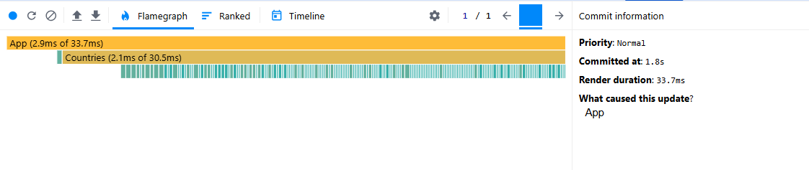
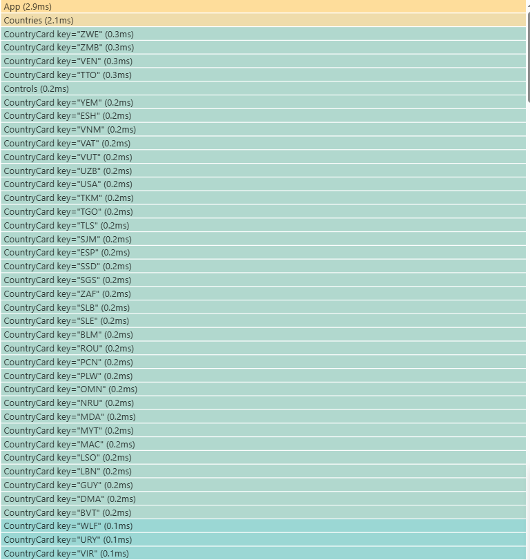
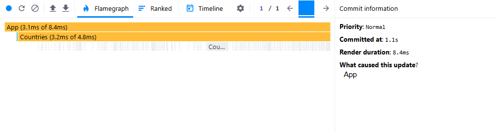
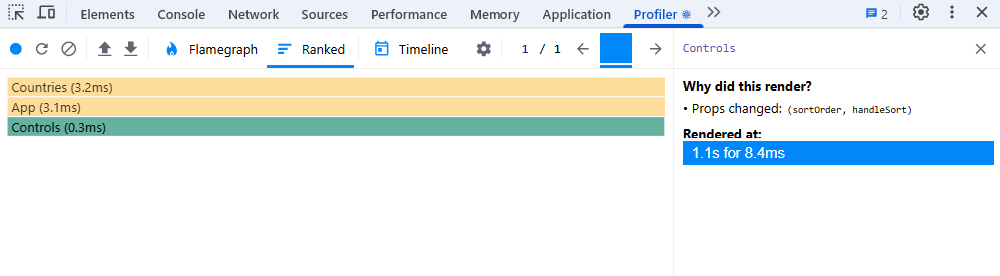

## Performance Analysis

### Initial Profiling

#### Commit Duration

The commit duration represents the time taken for React to render the committed updates.
The average commit duration was **33.7 ms**.

#### Render Duration

The `CountryCard` component had the highest render duration of **0.3 ms**.

#### Interactions

The following interactions were recorded during profiling:

- Sorting the country list by name.

#### Flame Graph

The flame graph below shows the visual representation of component render times:

#### Ranked Chart

The ranked chart below shows the sorted list of components by render duration:

### Optimized Profiling

#### Commit Duration

The commit duration after optimization was **8.4 ms**.

#### Render Duration

The render duration for the `CountryCard` component after optimization was **0 ms**.

#### Interactions

The following interactions were recorded during profiling after optimization:

- Sorting the country list by name.

#### Flame Graph

The flame graph below shows the visual representation of component render times after optimization:

#### Ranked Chart

The ranked chart below shows the sorted list of components by render duration after optimization:

